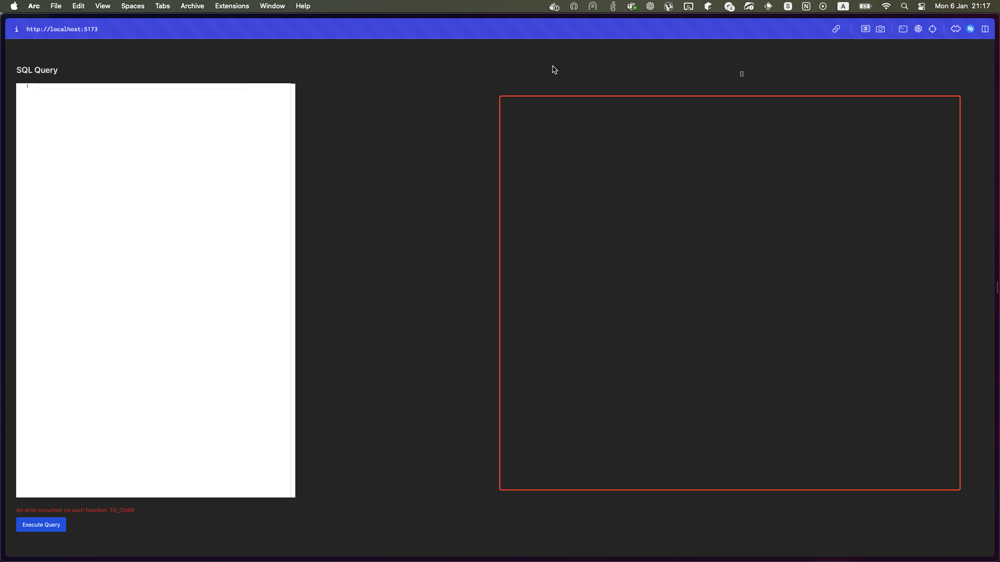

# Структура базы данных

Этот документ описывает структуру базы данных для проекта.

## Обзор таблиц

### 1. `Projects` (Проекты)
Эта таблица содержит информацию о проектах.

| **Название столбца** | **Тип данных**   | **Описание**                        |
|-----------------------|------------------|--------------------------------------|
| `ID`                 | `SERIAL`        | Уникальный идентификатор (автоинкремент). |
| `Name`               | `VARCHAR(255)`  | Название проекта.                   |

---

### 2. `Employees` (Сотрудники)
Эта таблица содержит информацию о сотрудниках.

| **Название столбца** | **Тип данных**   | **Описание**                        |
|-----------------------|------------------|--------------------------------------|
| `ID`                 | `SERIAL`        | Уникальный идентификатор (автоинкремент). |
| `FirstName`          | `VARCHAR(100)`  | Имя сотрудника.                     |
| `SecondName`         | `VARCHAR(100)`  | Отчество сотрудника (опционально).  |
| `LastName`           | `VARCHAR(100)`  | Фамилия сотрудника.                 |

---

### 3. `Documents` (Документы)
Эта таблица содержит информацию о документах, связанных с проектами и сотрудниками.

| **Название столбца** | **Тип данных**                     | **Описание**                        |
|-----------------------|------------------------------------|--------------------------------------|
| `ID`                 | `SERIAL`                          | Уникальный идентификатор (автоинкремент). |
| `DateCreated`        | `DATE`                            | Дата создания документа.            |
| `Type`               | `ENUM('Estimate', 'Contract')`    | Тип документа (Смета или Договор).  |
| `ResponsibleEmployee`| `INT`                             | Внешний ключ, ссылающийся на `Employees(ID)`. |
| `Project`            | `INT`                             | Внешний ключ, ссылающийся на `Projects(ID)`. |

---

# Задача

# Тестовое задание

## Часть 1: SQL-запрос

Написать SQL-запрос для подсчёта конверсии по ответственным сотрудникам.

### Условия:
- **Количество смет:** определяется по количеству документов типа `Estimate`.
- **Количество договоров:** определяется по количеству документов типа `Contract`.
- **Конверсия:** отношение количества смет к количеству договоров.
- **Группировка:** по сотрудникам и по месяцам.

## Часть 2: Визуализация в React

### Задачи:
1. Реализовать взаимодействие с API, которое:
    - Выполняет запрос данных с результатами SQL-запроса.
    - Отображает эти данные в таблице с использованием React.

2. Таблица должна включать:
    - Название месяца.
    - Имя и фамилию сотрудника.
    - Количество документов типа `Estimate` и `Contract`.
    - Значение конверсии в процентах.

---

### Требования к таблице:
- **Столбцы:**
    - Месяц.
    - Сотрудник.
    - Количество смет (`Estimate`).
    - Количество договоров (`Contract`).
    - Конверсия (%) = `(Количество смет / Количество договоров) * 100`.

- **Интерфейс:**
    - Допустимо использование библиотек, таких как **Ag-Grid**, **React Table** или аналогов.
    - Стилизация с использованием CSS или библиотек, например, **Material-UI** или **Ant Design**.

---

### Пример таблицы:
| **Месяц**   | **Сотрудник**    | **Estimate** | **Contract** | **Конверсия (%)** |
|-------------|------------------|--------------|--------------|-------------------|
| 2025-01     | Иван Иванов      | 10           | 5            | 200.00%          |
| 2025-02     | Анна Смирнова    | 8            | 4            | 200.00%          |
| 2025-03     | Александр Кузнецов | 6          | 3            | 200.00%          |

---

### Место для вставки таблицы react-app/src/components/SqlQueryTool.tsx

### Скриншот таблицы:

### Рекомендации:
1. **SQL-запросы:**
    - Используйте библиотеку sql-js

2. **Библиотеки для таблиц:**
    - Используйте **Ag-Grid**

3. **Стилизация:**
    - Для более профессионального внешнего вида можно использовать TailwindCSS.

## Часть 3: Соединение с CUBE js

**Документация** 

https://cube.dev/docs/product/introduction

**Задание**

Запустить в папке cube/docker-compose-local.yml.

Перенести этот запрос в cube, создав dimensions и measures  (https://cube.dev/docs/product/data-modeling/overview#1-creating-a-cube)

Создать файлы в папке model/cubes

C помощью React интеграции https://cube.dev/docs/product/apis-integrations/javascript-sdk/react

Вывести данные в таблицу из части 2

---

### Финальный результат:
1. **Видео:** Запишите демонстрацию работы приложения (например, скринкаст).
2. **Ссылка на репозиторий:** Загрузите проект в репозиторий (например, GitHub или GitLab) 

# Запуск проекта

Установите зависимости с помощью команды `npm install`

Запустите приложение с помощью команды `npm dev` 

